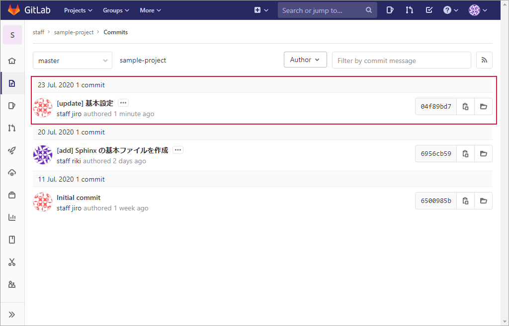
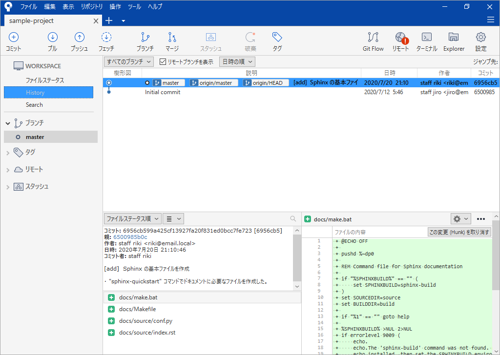
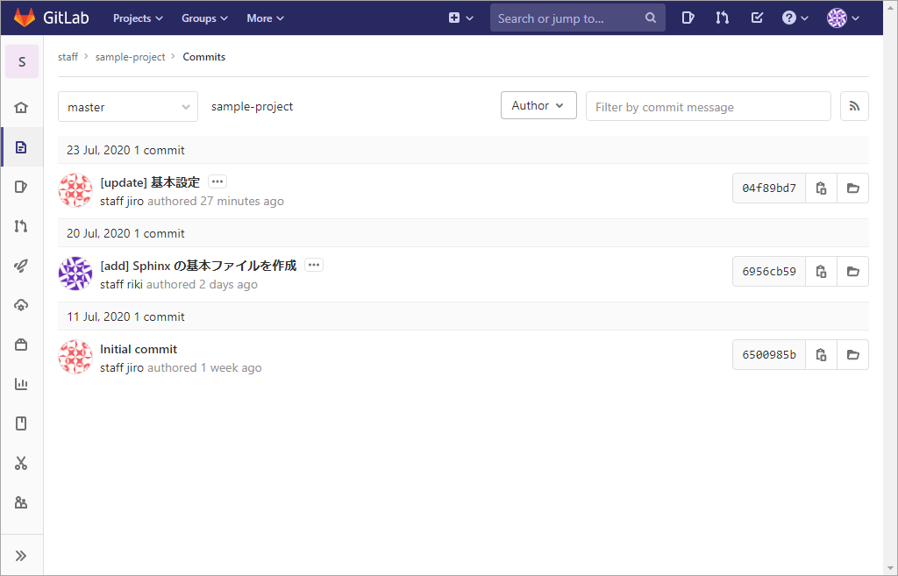
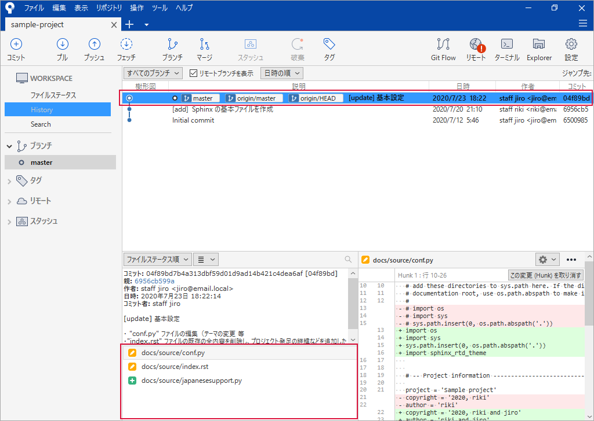

.. _repository-pull:

**************************************************
プル
**************************************************
リモートリポジトリの変更をローカルリポジトリに取り込みます。

| ● :ref:`repository-pull-mae`
| ● :ref:`repository-pull-sourcetree`
| ● :ref:`repository-pull-ato`

.. _repository-pull-mae:

プル前の状態
==================================================

GitLab サーバー
--------------------------------------------------
リモートリポジトリのコミットの履歴を確認すると、自分（ riki ）がリモートリポジトリにプッシュした後に jiro がプッシュしています。今回はこの jiro がプッシュした内容をローカルリポジトリに取り込みます。

Sourcetree
--------------------------------------------------
:ref:`repository-push-ato` と同じです。

|

.. _repository-pull-sourcetree:

Sourcetree
==================================================

#. :guilabel:`プル` をクリック

   .. image:: img/2020-07-23_18h42_02.png
      :scale: 65%

   |

#. 次のようになっていることを確認　→　:guilabel:`プル` をクリック

   .. list-table::
      :widths: 3, 1, 4

      * - 項目
        - 選択値
        - 備考
      * - 次のリモートからプル
        - origin
        - 「リモートリポジトリ」のこと
      * - プルするリモートブランチ
        - master
        -
      * - 次のブランチにプル
        - master
        - 

   .. image:: img/2020-07-23_18h46_21.png
      :scale: 65%

   |

#. プル中

   .. image:: img/2020-07-23_18h47_02.png
      :scale: 65%

   |

#. プル終了

   .. image:: img/2020-07-23_18h47_32.png
      :scale: 65%
   
   |

.. _repository-pull-ato:

プル後の状態
==================================================

GitLab サーバー
--------------------------------------------------
プルはリモートリポジトリの内容を更新しないので :ref:`repository-pull-mae` と同じです。

Sourcetree
--------------------------------------------------
jiro がコミットした内容を取り込み、履歴が進んでいます。プル直後はリモートリポジトリとローカルリポジトリが同期されてているので ``master`` ・ ``origin/master`` ・ ``origin/HEAD`` は同じ位置です。

| 取り込まれたファイルは以下のとおりです。
| ・ 修正　:file:`docs/source/conf.py`
| ・ 修正　:file:`docs/source/index.rst`
| ・ 追加　:file:`docs/source/japanesesupport.py`

|
