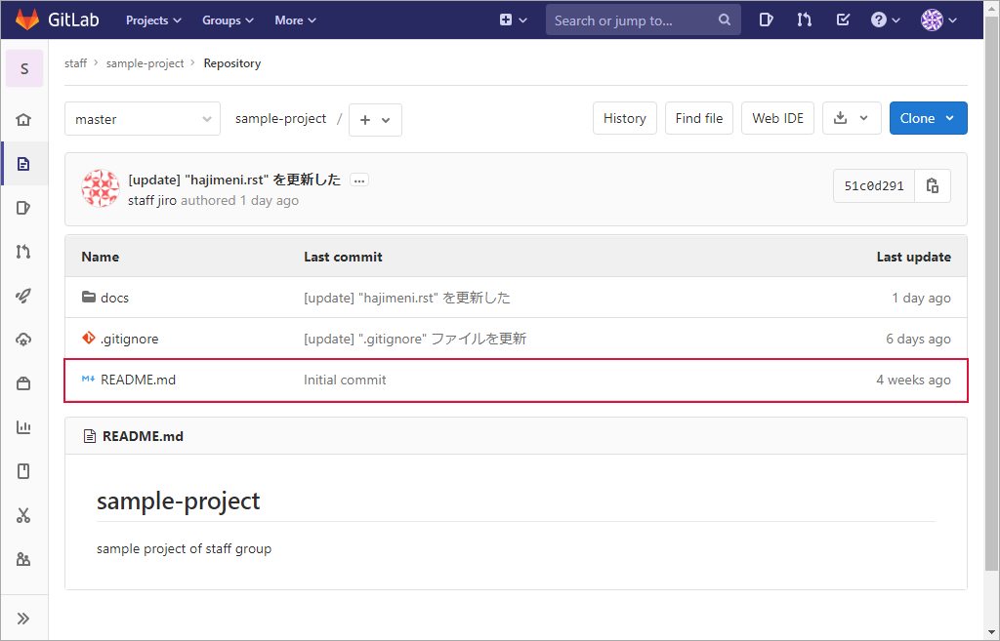
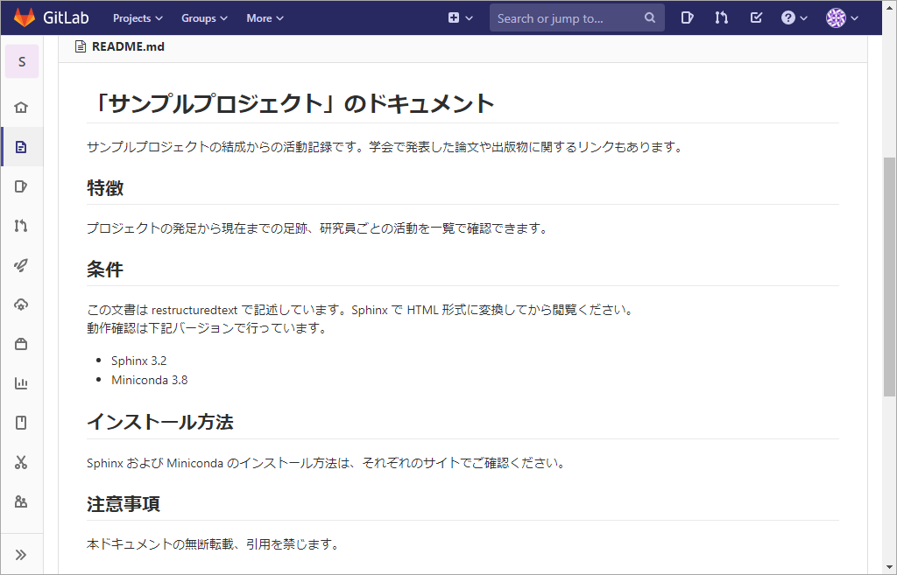

.. _readme:

**************************************************
"README.md" ファイル
**************************************************
| ● :ref:`readme-about`
| ● :ref:`readme-template`
| ● :ref:`readme-sample`

.. _readme-about:

"README.md" ファイルとは
==================================================

:file:`README.md` ファイルは訪問者にプロジェクトの説明をするファイルです。一言で表すとプロジェクトの紹介文であり、次の内容を含みます。

- プロジェクトが行うこと
- プロジェクトが有益な理由
- プロジェクトの使い始める方法
- プロジェクトに関するヘルプをどこで得るか
- プロジェクトのメンテナンス者とコントリビューター（貢献している人）

訪問者はこの :file:`README.md` ファイルの内容で、このプロジェクトを使用するか否か（＝　自分にとってメリットがあるかどうか）の最初の判断をします。

拡張子の ``md`` は "markdown" の略です。拡張子が示すとおりマークダウン記法が使用できるので、単なるテキスト文書よりも表現に富んだ文書を作成できます。

.. _readme-template:

テンプレート
==================================================
下記のようなテンプレートを用意しておくと、記述漏れなどを防止できます。

.. literalinclude:: ./readme-template.txt
   :language: none

.. _readme-sample:

サンプル
==================================================
.. literalinclude:: ./readme-sample.txt
   :language: none

表示例の一部です。

