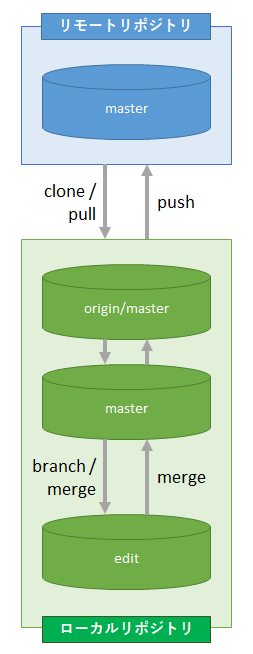

.. _teams-case1:

**************************************************
Case #1 ： 同じプロジェクト × レビューなし
**************************************************
レビューを行わない　＝　誰でもリモートリポジトリの ``master`` ブランチにプッシュできます。通常、成果物の品質の担保はレビューで確保します。そのため、レビューを行わない　＝　品質を担保しません。。だれでもプッシュできるようにするには、GitLab のデフォルト設定の場合、メンバーの :ref:`group-no-sakusei-member-no-tsuika-role-permission` は "Maintainer" でなければなりません。

全体のイメージです。

#. リモートリポジトリをクローンしてローカルリポジトリを作成
#. ローカルリポジトリの ``master`` ブランチを元に、作業用のブランチ（今回は ``edit`` ブランチ）を作成
#. 作業用ブランチで作業（編集、コミット 等）
#. 一区切り後に作業用ブランチを ``master`` ブランチにマージ
#. リモートリポジトリの ``master`` ブランチにプッシュ

※ 後は手順 2. 以降の繰り返し作業です。

作業中に他の人がリモートリポジトリにプッシュしたら、次の手順で取り込みます。

#. 変更内容をローカルリポジトリの ``master`` ブランチにプル
#. 適当なタイミングで ``master`` ブランチに取り込んだ変更内容を作業用ブランチにマージ
