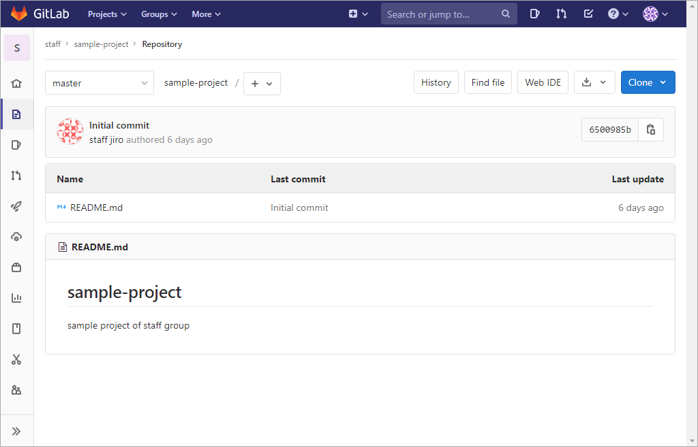
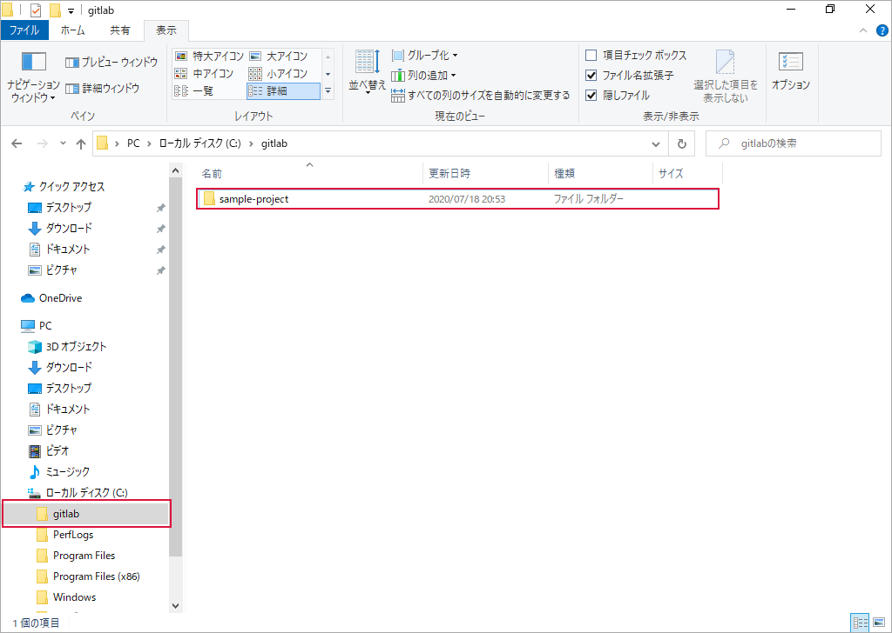

.. _repository-clone:

**************************************************
クローン
**************************************************
「 :ref:`project-no-sakusei` 」で作成したリモートリポジトリをクローンしてローカルリポジトリを作成します。

| ● :ref:`repository-clone-gitlab-server`
| ● :ref:`repository-clone-folder1`
| ● :ref:`repository-clone-git-client`
| ● :ref:`repository-clone-folder2`

.. _repository-clone-gitlab-server:

GitLab サーバー
==================================================
リモートリポジトリの状態です。 :file:`README.md` ファイルが登録されています。

|

#. :guilabel:`Clone` をクリック

   .. image:: img/2020-07-18_20h37_35.png
      :scale: 65%

   |

#. :guilabel:`Clone with HTTPS` に示された URL の右側のアイコンをクリック（ URL をクリップボードにコピー）

   .. image:: ./img/2020-07-18_20h41_36.png
      :scale: 65%

   |

.. _repository-clone-folder1:

ローカルリポジトリを登録するフォルダーを作成
==================================================
ローカルリポジトリを登録する :file:`gitlab` フォルダーを作成します。フォルダー内は空です。

.. image:: img/2020-07-18_20h46_37.png
   :scale: 65%

|

.. _repository-clone-git-client:

Sourcetree
==================================================

#. :guilabel:`Clone` をクリック

   .. image:: ./img/2020-07-18_20h49_57.png
      :scale: 65%

   |

#. 次の値を入力　→　:guilabel:`クローン` をクリック

   .. list-table::
      :widths: 1, 2, 2

      * - 項目
        - 入力値
        - 備考
      * - 元のパス/URL
        - https://gitlab.local/staff/sample-project.git
        - 上述の手順でクリップボードにコピーした URL を貼り付け
      * - 保存先のパス
        - c:\\gitlab\\sample-project
        - リポジトリを保存するフォルター（ワーキングディレクトリ）
      * - 名前
        - sample-project
        - 「保存先のパス」のフォルダーの値を元に自動設定される
      * - Local Folder:
        - [ルート]
        - デフォルトのまま

   .. image:: ./img/2020-07-18_20h53_23.png
      :scale: 65%

   |

   処理の途中で下図が表示されたら次の値を選択　→　:guilabel:`Select` をクリック

   .. list-table::
      :widths: 2, 1, 1

      * - 項目
        - 選択値
        - 備考
      * - Select a credential helper
        - <no helper>
        -
      * - Always use this from now on
        - チェックを入れる
        - 

   .. image:: ./img/2020-07-18_20h50_47.png
      :scale: 100%

   |

   処理の途中で下図が表示されたら次の値を入力　→　:guilabel:`Login` をクリック

   .. list-table::

      * - 項目
        - 選択値
        - 備考
      * - Username
        - riki
        - GitLab サーバーにログインするときの Username
      * - Password
        - riki@password
        - GitLab サーバーにログインするときのパスワード
      * - Remember password
        - チェックを入れる
        - 

   .. image:: ./img/2020-07-18_20h51_43.png
      :scale: 100%

   |

#. クローン中

   .. image:: ./img/2020-07-18_20h53_55.png
      :scale: 65%

   |

#. クローン終了

   .. image:: ./img/2020-07-18_20h54_09.png
      :scale: 65%

   |

#. :guilabel:`History` をクリック　→　クローンした結果を確認

   リモートリポジトリをクローンした直後のローカルリポジトリはの状態はリモートリポジトリと同じなので、 ``master`` ・ ``origin/master`` ・ ``origin/HEAD`` の位置がすべて同じになります。

   .. image:: img/2020-07-18_20h55_41.png
      :scale: 65%

   |

.. _repository-clone-folder2:

クローン後のローカルリポジトリを登録するフォルダーの状態
====================================================================================================

クローン後の :file:`gitlab` フォルダー内の状態です。フォルダー内に :file:`sample-project` フォルダーが作成されました。

:file:`sample-project` フォルダー内の状態です。 :file:`.git` フォルダーがクローンされたリポジトリの本体です。 :file:`README.md` はリポジトリに含まれるファイルです。

.. image:: ./img/2020-07-18_21h00_32.png
   :scale: 65%

|
