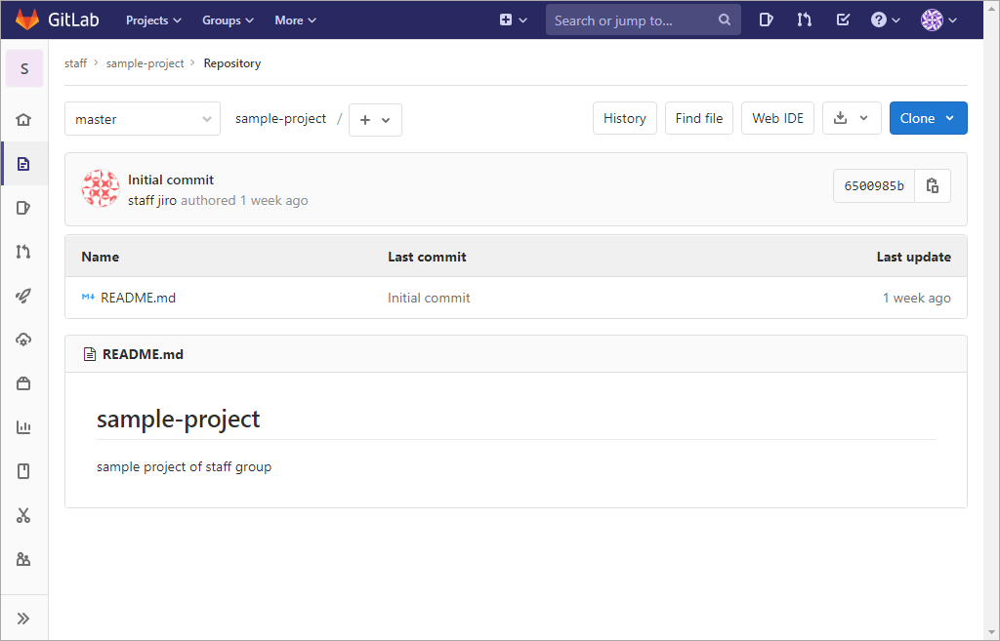
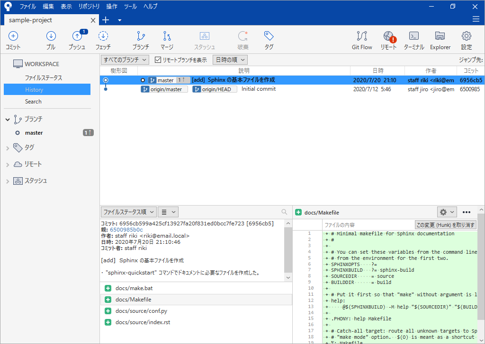
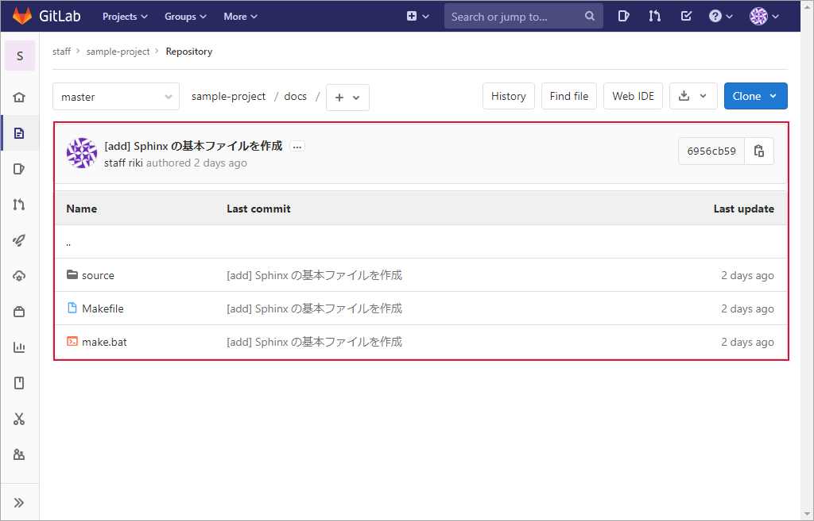
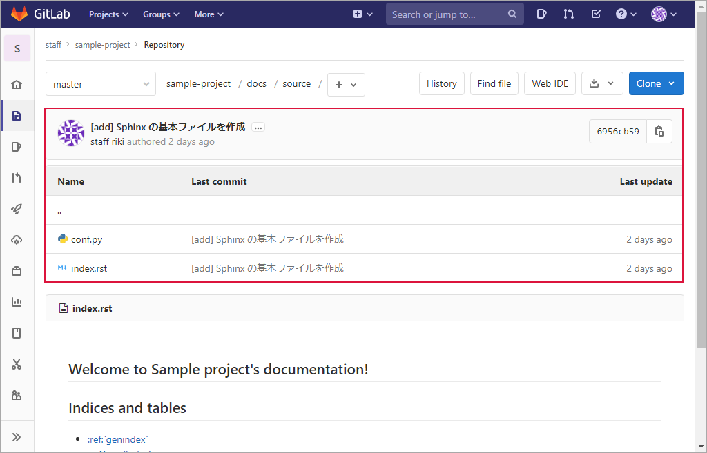
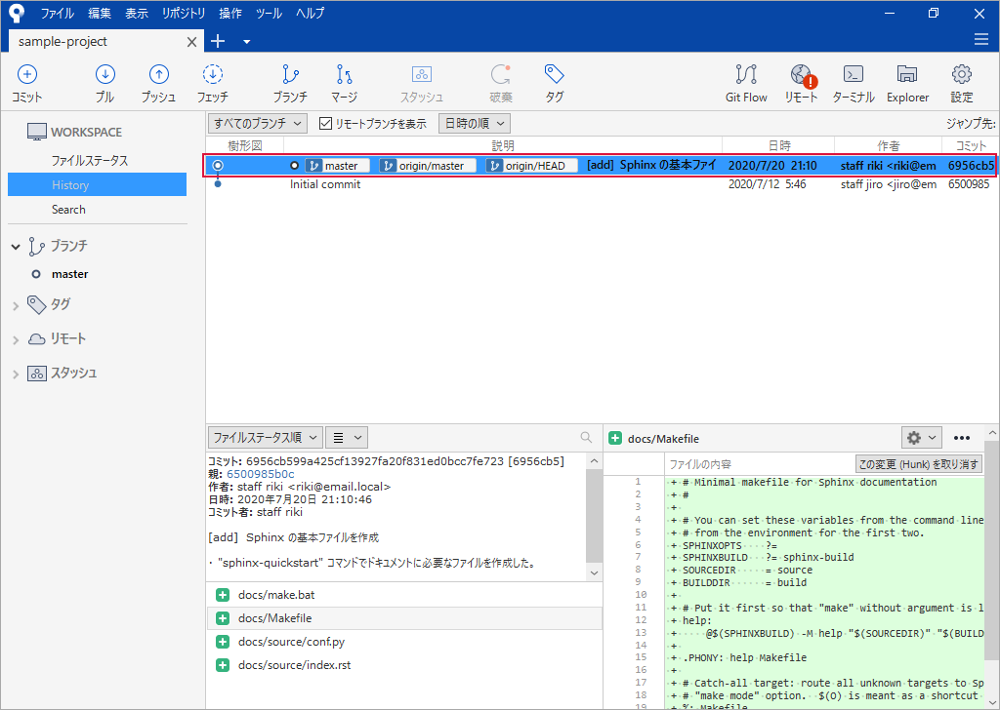

.. _repository-push:

**************************************************
プッシュ
**************************************************
コミット後のローカルリポジトリの内容をリモートリポジトリに反映します。反映対象はコミットしたファイルです。

| ● :ref:`repository-push-mae`
| ● :ref:`repository-push-sourcetree`
| ● :ref:`repository-push-ato`
| ● :ref:`repository-push-rireki`

.. _repository-push-mae:

プッシュ前の状態
==================================================

GitLab サーバー
--------------------------------------------------
:ref:`repository-clone` 時の状態と同じです。

Sourcetree
--------------------------------------------------
:ref:`repository-commit-ato` と同じです。

|

.. _repository-push-sourcetree:

Sourcetree
==================================================
#. :guilabel:`プッシュ` をクリック

   .. image:: img/2020-07-23_15h13_38.png
      :scale: 65%

   |

#. 次のようになっていることを確認　→　:guilabel:`プッシュ` をクリック

   .. list-table::
      :widths: 2, 2, 1

      * - 項目
        - 選択値
        - 備考
      * - 対象
        - チェックが入っていること
        - 
      * - ローカルブランチ
        - master
        -
      * - リモートブランチ
        - master
        - 

   .. image:: img/2020-07-23_15h15_08.png
      :scale: 65%

   |

#. プッシュ中

   .. image:: img/2020-07-23_15h15_26.png
      :scale: 65%
   
   |

#. プッシュ終了

   .. image:: img/2020-07-23_15h15_34.png
      :scale: 65%

   |

.. _repository-push-ato:

プッシュ後の状態
==================================================

GitLab サーバー
--------------------------------------------------
:ref:`repository-commit` したフォルダーやファイルがプッシュ（アップロード）され、ローカルリポジトリの内容がリモートリポジトリに反映されました。

.. image:: img/2020-07-23_15h20_22.png
   :scale: 65%

|

:file:`doc` フォルダーの内容です。

|

:file:`source` フォルダーの内容です。

Sourcetree
--------------------------------------------------
ローカルリポジトリとリモートリポジトリが同じ内容になったので、 ``master`` ・ ``origin/master`` ・ ``origin/HEAD`` が同じ位置に表示されています。

|

.. _repository-push-rireki:

履歴の確認
==================================================

GitLab サーバー
--------------------------------------------------

#. プロジェクト名をクリック

   .. image:: img/2020-07-23_15h32_48.png
      :scale: 65%

   |

#. :guilabel:`2 Commits` をクリック

   "2 Commits" は 2 回コミットされたという意味です。

   .. image:: img/2020-07-23_15h34_07.png
      :scale: 65%

   |

#. コミットの履歴を確認

   .. image:: img/2020-07-23_15h35_23.png
      :scale: 65%

   |

#. コメントをクリック

   .. image:: img/2020-07-23_15h35_51.png
      :scale: 65%

   |

#. コミット内容の詳細を表示

   .. image:: img/2020-07-23_15h37_57.png
      :scale: 65%

Sourcetree
--------------------------------------------------

#. :guilabel:`History` をクリック

   .. image:: img/2020-07-23_15h39_34.png
      :scale: 65%

   |

#. コミット内容を確認

   .. image:: img/2020-07-23_15h40_13.png
      :scale: 65%
