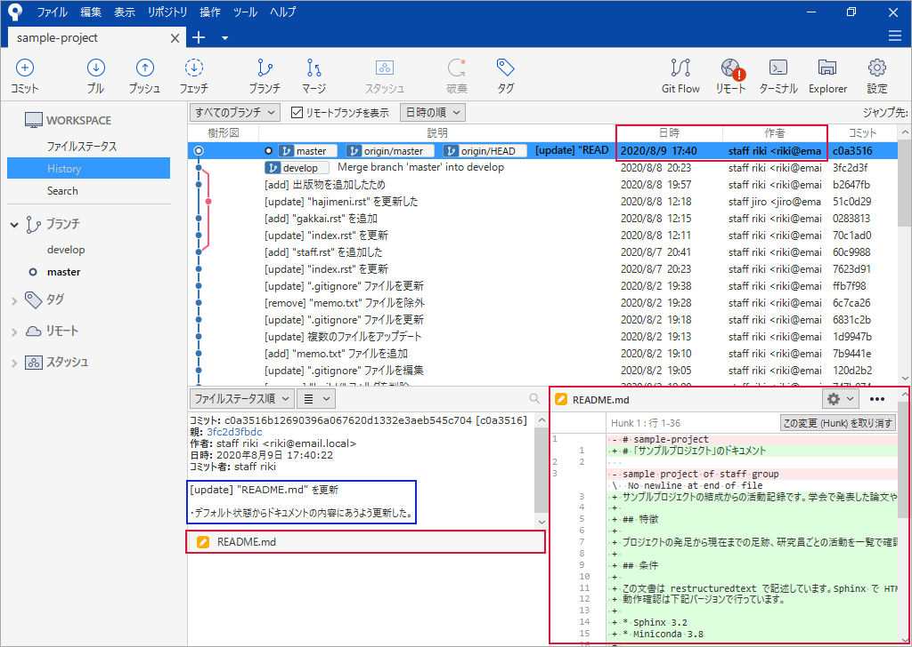

.. _commit-message:

**************************************************
コミットメッセージ
**************************************************
| ● :ref:`commit-message-kakukoto`
| ● :ref:`commit-message-format`
| ● :ref:`commit-message-sample`

.. _commit-message-kakukoto:

書くこと
==================================================

コミットをしたとき

- いつ（日時）
- 誰が（作者）
- どれを（どのファイルを）
- どのように（行の追加、削除 等）

は自動で設定（赤枠）されますが、

- 何を（したのか）
- なぜ（したのか）

はコミット時のメッセージ（青枠）に書きます。後から見返したとき、コミットメッセージからどの様なコミットを行ったのかを確認できるようにします。

.. _commit-message-format:

フォーマット
==================================================

フォーマット
--------------------------------------------------
1 行目
   - コミットのタイトルを書きます
   - タイトルはコミットの種別と概要（何をしたのか）で構成されます

2 行目
   - 空行

3 行目
   - なぜコミットしたのか、その理由を書きます
   - 理由が複数ある場合は箇条書きにします

コミットの種別
--------------------------------------------------
タイトルに書くコミットの基本的な種別です

====== ===========================================
種別   内容
add    追加（ファイルの追加、機能の追加 など）
remove 削除（ファイルの削除、機能の削除 など）、"delete" でも良い
update 更新
fix    修正（不具合の修正）
====== ===========================================

- 種別は日本語で記述しても構いません。どの様な表記にするのはプロジェクトの開始時に決定しておきます。
- 必要に応じて種別を追加（細分化）しても構いません。ただし、後から追加すると既存のコメントとの整合性が取りなくなる可能性があるため、細分化するかどうかはプロジェクトの開始時に決定しておくと良いでしょう。

.. _commit-message-sample:

サンプル
==================================================
.. code-block:: none

   [update] "README.md" ファイルを更新した
   
   ・ デフォルトの状態からドキュメントの内容に沿うよう更新したため。

.. code-block:: none

   [add] 「研究成果」のページを追加した
   
   ・ 新規ファイル　→　"seika.rst"　：　研究成果のメインページ
   ・ 更新ファイル　→　"index.rst"　：　"seika.rst" へのリンクを追加した
