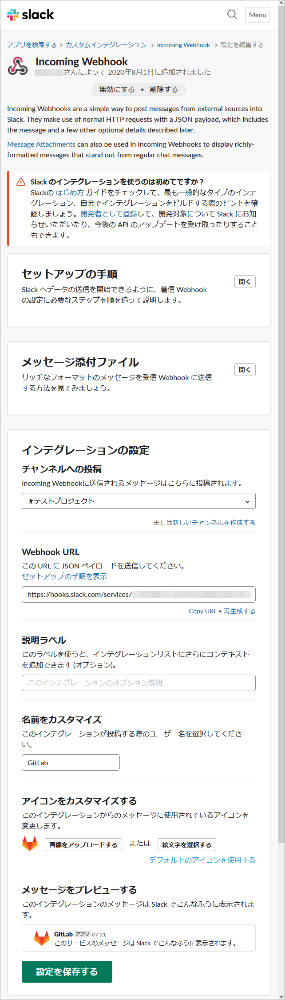

.. _slack:

**************************************************
Slack に通知を飛ばす
**************************************************
プロジェクトごとにリモートリポジトリの状態が更新されたとき、 Slack の指定したチャンネルにメッセージを送信できます。

Slack
==================================================
Incoming Webhock をインストール・設定します。 GitLab で使用するのは次の 2 つの項目です。

- チャンネルへの投稿（ GitLab から投稿するチャンネルを指定）
- Webhook URL

詳細な説明は省きますが、次のような設定になります。アイコンはカスタマイズしています。

|

GitLab
==================================================
プロジェクトごとに設定します。

#. 設定するプロジェクト名をクリック

   .. image:: ./img/2020-08-01_19h51_00.png
      :scale: 65%

   |

#. :guilabel:`Settings` 　→　:guilabel:`Integrations` の順にクリック

   .. image:: ./img/2020-08-01_07h38_52.png
      :scale: 65%

   |

#. :guilabel:`Slack notifications` をクリック

   .. image:: ./img/2020-08-01_07h40_48.png
      :scale: 65%

   |

#. :guilabel:`Active` が有効になっていることを確認

   .. image:: ./img/2020-08-01_07h41_46.png
      :scale: 65%

   |

#. :guilabel:`Trigger` 内の通知を飛ばすアクションに slack の「チャンネルへの投稿」に指定したチャンネル名を入力

   .. image:: ./img/2020-08-01_07h42_21.png
      :scale: 65%
   
   |

#. 次の値を入力

   .. list-table::
      :widths: 1, 3, 2

      * - 項目
        - 入力値
        - 備考
      * - Webhook
        - https://hooks.slack.com/service/・・・・
        - Slack の「 Webhook URL 」を入力
      * - Username
        - GitLab for Sample Project
        - Slack に投稿するときのユーザー名

   .. image:: ./img/2020-08-01_14h01_16.png
      :scale: 65%

   |

#. :guilabel:`Branches to be notified` のプルダウンリストから通知対象のブランチを選択

   .. image:: ./img/2020-08-01_14h01_24.png
      :scale: 65%

   ↓

   .. image:: ./img/2020-08-01_14h01_38.png
      :scale: 65%

   |

#. :guilabel:`Test settings and save changes` をクリック

   .. image:: ./img/2020-08-01_14h01_38a.png
      :scale: 65%

   |

#. 設定したインテグレーション（ Slack notifications ）に緑色の ● が付いたことを確認

   .. image:: ./img/2020-08-01_14h01_56.png
      :scale: 65%

   |

#. 正しく設定ができていると Slack の指定したチャンネルに次のようなメッセージが届く

   .. image:: ./img/2020-08-01_14h22_17.png
      :scale: 100%

   |
